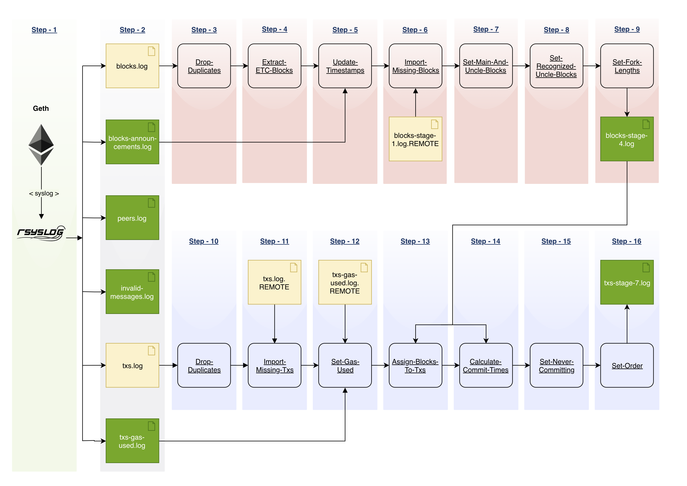

This repository contains the tool used in the paper `Impact of geo-distribution and mining pools on blockchains: a study of Ethereum` published in [DSN'2020](https://dsn2020.webs.upv.es/) - 2020 IEEE/IFIP International Conference on Dependable Systems and Networks. An author's copy of the paper is available [here](https://angainor.science/papers/dsn_ethereum.pdf)

# Ethereum Monitoring Client (EMC)
EMC is a platform for measuring the Ethereum network. The two main components are the modified Ethereum client (go-ethereum) and a logger (rsyslog).

## Project structure

##### go-ethereum
Contains the measurement Ethereum client based on [Geth 1.8.23](https://github.com/ethereum/go-ethereum/tree/release/1.8).

##### rsyslog
A Rsyslog configuration to capture logs from go-ethereum.

##### run_client.sh
Executes the measuring instance. 
A number of comma-separated values (CSV) log files are generated.
These store information on transactions, blocks, connected peers and invalid messages.

##### log-pre-processing
Contains Shell and Python scripts that process the raw logs.

##### metrics
A set of scripts that plot metrics.

## Building the source

Building `geth` requires both a Go (version 1.10 or later) and a C compiler. You can install
them using your favourite package manager. Once the dependencies are installed, run

```shell
cd go-ethereum/
make geth
```


## Running `EMC`

### Deploy and start the logging manager
Overwrite the system rsyslog configuration with the EMC Rsyslog configuration. Then restart rsyslog:

```shell
$ cp rsyslog/rsyslog.conf /etc/rsyslog.conf
$ sudo service rsyslog restart
```

### Start Geth
Start the Ethereum client using the command below:
```shell
$ run_client.sh
```
In order to stop the measurement simply kill the `geth` process.

## Metrics

After a successful measurement, post processing of the logs is required. 
One only needs to follow the instructions in `readme` files in the `log-pre-processing` folder and its subfolders.

### Log processing
The simplyfied picture of log-processing is depicted on the diagram below:


Geth stores types of logs (column 'Step-2' on the diagram) in a number 
of CSV files (e.g., blocks.log and txs.log). 
These logs are processed in several scripts (Steps 3-16).

### Ploting results
The `metrics` folder contains a set of python-3 scripts for plotting various metrics. Each file contains a description about how to run it.


## License

The content of this repository outside of the `go-ethereum` directory is licensed under the
[GNU Lesser General Public License v3.0](https://www.gnu.org/licenses/lgpl-3.0.en.html).

The license specification of the `go-ethereum` directory is defined in the `go-ethereum/README.md` file.
